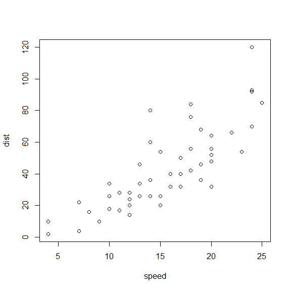
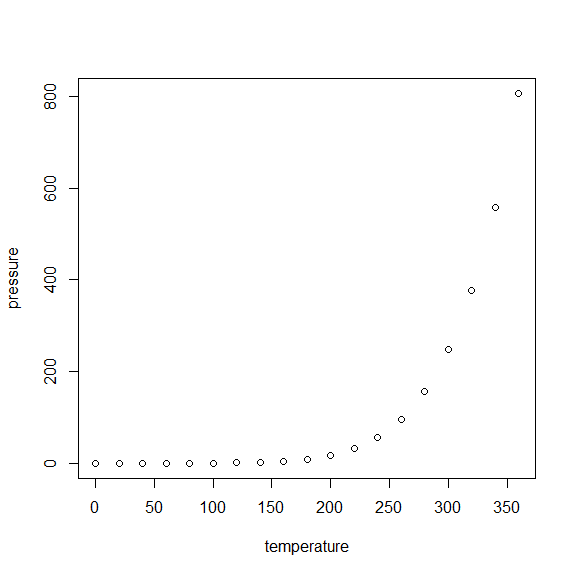

# Module 3 - HTML document

## R Markdown {#nextsteps .ephasized}

This is an R Markdown document. Markdown is a simple formatting syntax for authoring HTML, PDF, and MS Word documents. For more details on using R Markdown see <http://rmarkdown.rstudio.com>.

When you click the **Knit** button a document will be generated that includes both content as well as the output of any embedded R code chunks within the document. You can embed an R code chunk like this:

### Plot the Cars dataset


``` r
plot(cars)
```

<!-- -->

## Including Plots

You can also embed plots, for example:

### Plot the presure dataset

<!-- -->

Note that the `echo = FALSE` parameter was added to the code chunk to prevent printing of the R code that generated the plot.

## A Short List

 *apples
 *oranges
 *bananas

## A simple equation 

$$ Y = \beta_0 + \beta_1*X $$
